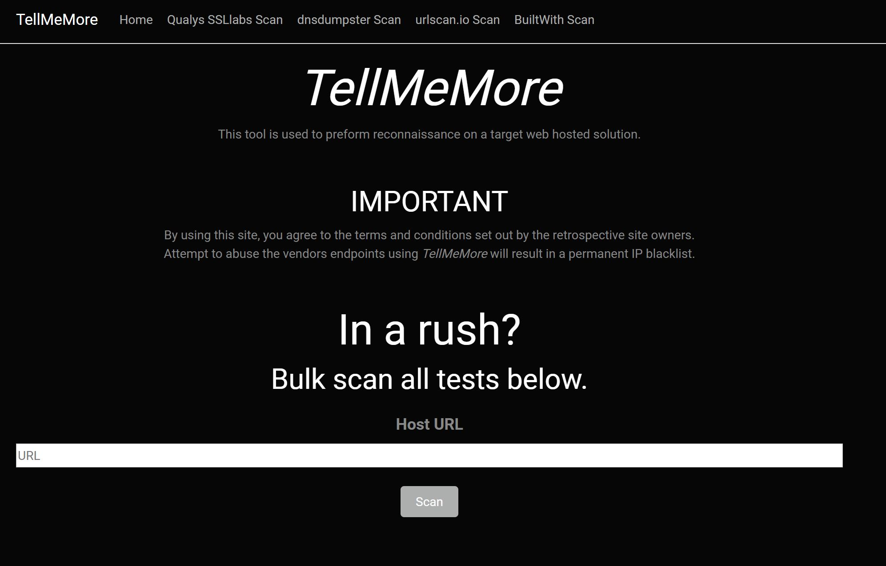

# TellMeMore
Web app to collectively preform reconnaissance on web hosted solutions

## Features

- Qualys SSL Labs Scan
- urlscan.io Scan
- dnsdumpster Scan
- BuiltWith Scan
- Bulk Scan (all sites) Scan
- PDF export - (coming soon..)
- Excel export - (coming soon..)

## Instructions

- Open .sln file
- Restore and Build sln/project
- Go to https://urlscan.io and sign up for a free API key
- Go to https://api.builtwith.com/free-api and sign up for a free API key
- Ensure API keys are in application.Development.json file
- cd to /dnsdumpster-PythonAPI and run 'pip install requirements.txt'
- In the same directory after install has completed run 'python main.py' to start API
- F5 run project

 

